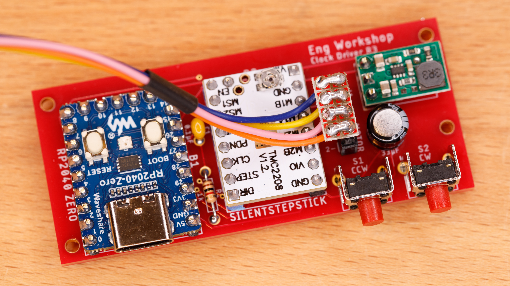

# clock-driver

### Step 1

Solder the DS3234 clock chip on underside of the PCB. This is easily done with a fine-tipped [soldering iron and desoldering braid](https://www.sparkfun.com/tutorials/96).

### Step 2
This is just text
### Step 3

