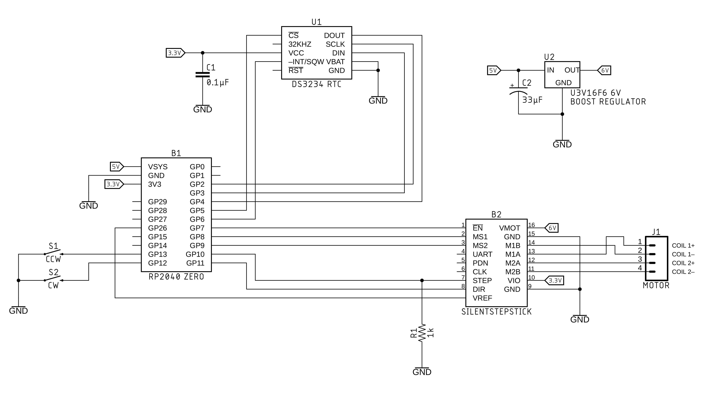
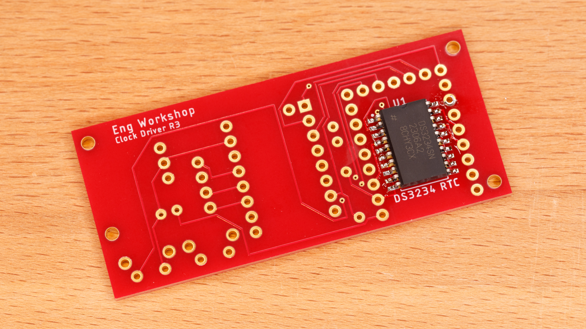
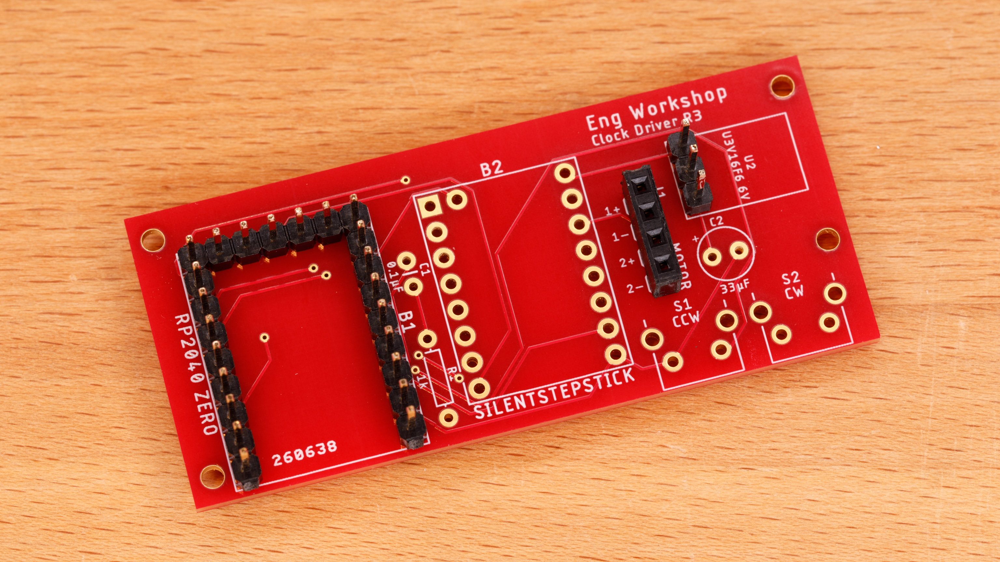
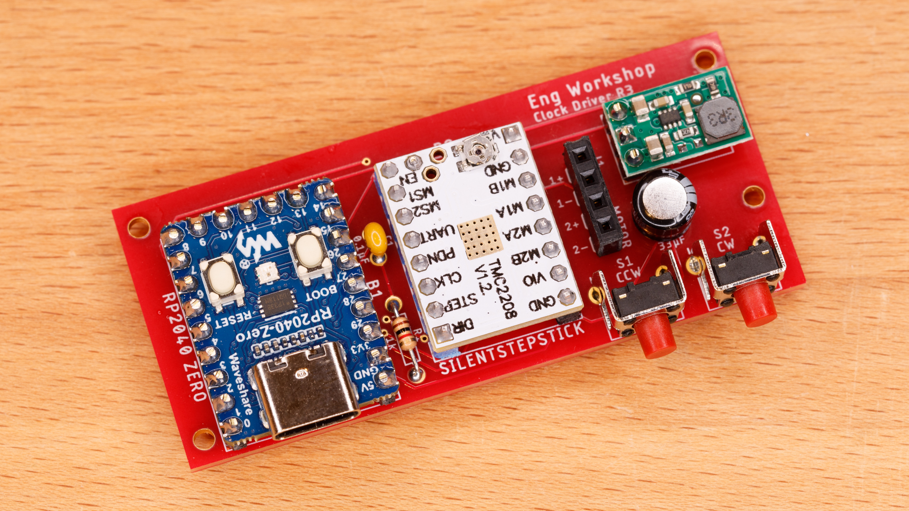
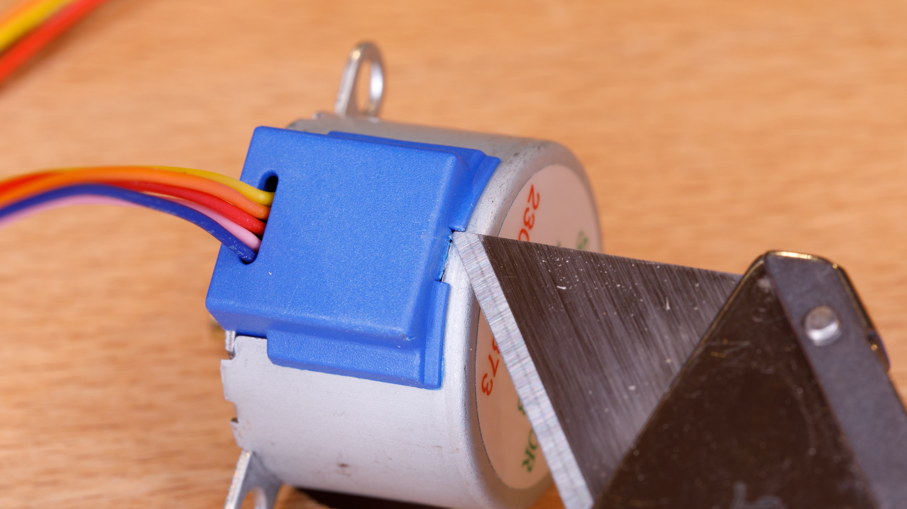
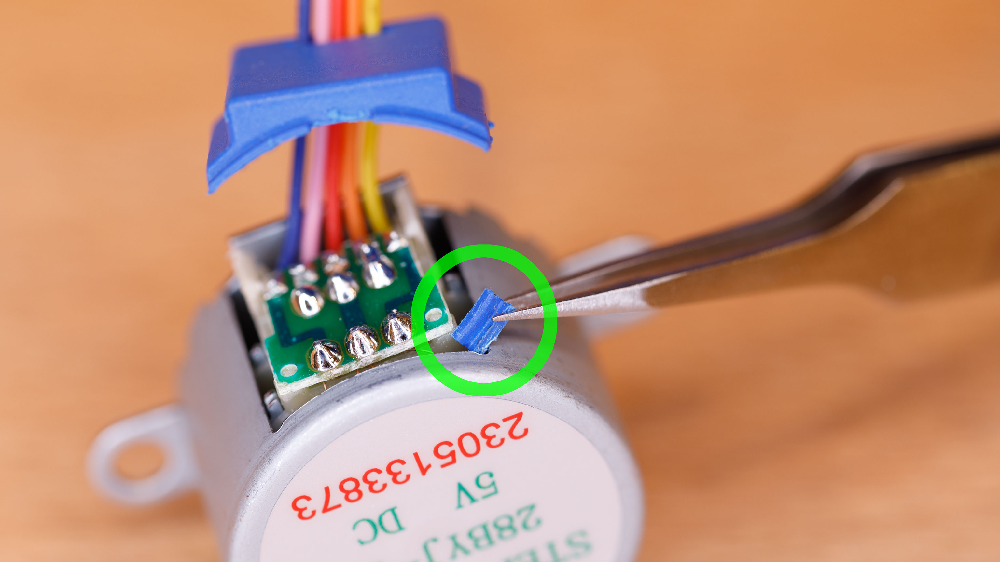
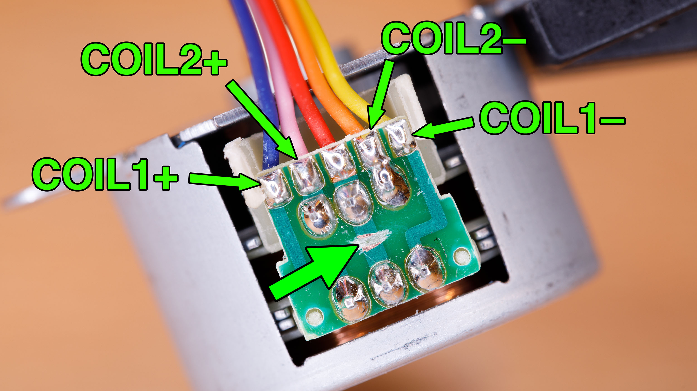
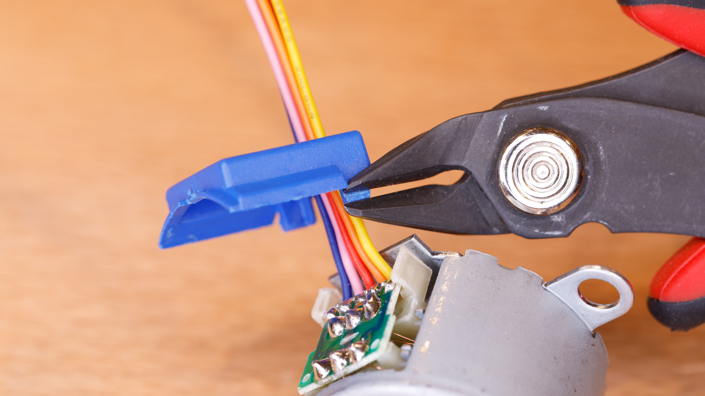

# clock-motor-driver

This repository contains design files for a custom driver printed circuit board (PCB) for the [Mystery Clock](https://makerworld.com/en/models/764838) and [Hollow Clock 4 Remix](https://makerworld.com/en/models/875220) projects on [MakerWorld](https://makerworld.com/en/@EngWorkshop). This driver board incorporates 2 improvements: a dedicated real-time clock chip (the Maxim DS3234) for greater timekeeping accuracy and a dedicated stepper motor driver module (incorporating the Trinamic TMC2208) for quieter motor operation.

The clock projects use a small, inexpensive 28BYJ-48 5V unipolar stepper motor. This motor must be converted to a bipolar configuration before it can be connected to the custom driver board. Conversion instructions are included at the bottom of this README file.

(All products shown or mentioned are items that I actually use and have found to work well. I have no relationship with any product supplier.)

## 1.&nbsp;&nbsp; The Circuit

### Parts List
- [Waveshare RP2040-Zero](https://www.waveshare.com/rp2040-zero.htm) microcontroller board without pin headers
- [TMC2208 SilentStepStick](https://www.amazon.com/gp/product/B08DFVZV5Q) stepper motor driver module
- [Pololu U3V16F6](https://www.pololu.com/product/4942) 6V boost voltage regulator
- Maxim DS3234 real-time clock chip ([DigiKey DS3234SN#-ND](https://www.digikey.com/en/products/detail/analog-devices-inc-maxim-integrated/DS3234SN/1197584))
- (2) C&K PTS645VK83-2LFS right angle tactile switches ([DigiKey CKN10950-ND](https://www.digikey.com/en/products/detail/c-k/PTS645VK83-2-LFS/3861399))
- 33 µF electrolytic capacitor (for example, [DigiKey P977-ND](https://www.digikey.com/en/products/detail/panasonic-electronic-components/ECE-A1EKS330/160557))
- 1 kΩ resistor (for example, [DigiKey 1.0KEBK-ND](https://www.digikey.com/en/products/detail/yageo/CFR-12JB-52-1K/4000))
- 0.1 µF ceramic capacitor (for example, [DigiKey 399-4264-ND](https://www.digikey.com/en/products/detail/kemet/C320C104K5R5TA/818040))
- male headers (for example, [DigiKey S1011EC-40-ND](https://www.digikey.com/en/products/detail/sullins-connector-solutions/PRPC040SAAN-RC/2775214))
- (4) M2 x 5 mm self-tapping pan head screws for mounting PCB (for example, [Amazon](https://www.amazon.com/gp/product/B07ZH9GJWP))
- [28BYJ-48 5V geared stepper motor](https://www.amazon.com/gp/product/B01CP18J4A)

## 2.&nbsp;&nbsp; Obtaining the PCB
how to get it manufactured
Gerber files

## 3.&nbsp;&nbsp; Soldering the PCB

### Step 3.1

Solder the DS3234 clock chip on underside of the PCB. This is fairly easy to do with a fine-tipped soldering iron and desoldering braid ([SparkFun tutorial](https://www.sparkfun.com/tutorials/96)). No dedicated SMD soldering equipment is necessary.

### Step 3.2

Solder male headers for the RP2040 Zero and voltage regulator. Optional: solder a female header for the motor. If you are making a Mystery Clock or Hollow Clock 4 Remix, *do not* solder a connector for the motor. Instead, the motor wires will need to be soldered directly to the PCB in order to fit in the clock base.

### Step 3.3

Solder the remaining parts onto the PCB. The PCB can be mounted with M2 screws.

## 4.&nbsp;&nbsp; Converting the Stepper Motor from Unipolar to Bipolar

### Step 4.1

With a utility knife, score the small tab on the plastic motor cover until it breaks off. Pry open the cover.

### Step 4.2

Remove the small plastic tab that was broken off in Step 3.1.

### Step 4.3

With a utility knife, carefully cut/scrape the center PCB trace ([SparkFun tutorial](https://learn.sparkfun.com/tutorials/how-to-work-with-jumper-pads-and-pcb-traces/cutting-a-trace-between-jumper-pads)). The middle (red) wire can also be clipped off. Note the wire color corresponding to coil connections.

### Step 4.4

Glue the plastic cover back on the motor. If necessary, trim the remaining tabs so that the cover can be inserted easily.
